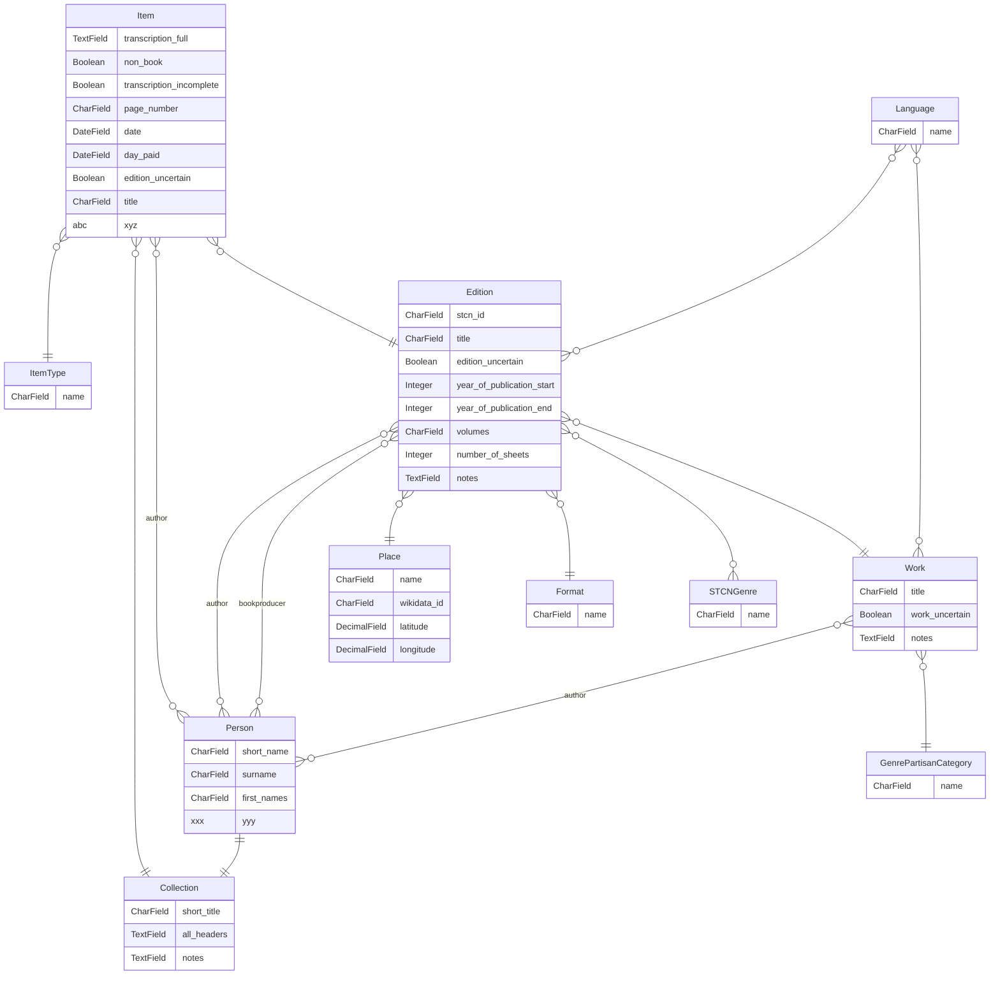

```mermaid
erDiagram

  Person {
      CharField short_name
      CharField surname
      CharField first_names
      xxx yyy
  }
  Language {
      CharField name
  }
  Place {
      CharField name
      CharField wikidata_id
      DecimalField latitude
      DecimalField longitude
  }
  Item {
      TextField transcription_full
      Boolean non_book
      Boolean transcription_incomplete
      CharField page_number
      DateField date
      DateField day_paid
      Boolean edition_uncertain
      CharField title
      abc xyz
  }
  ItemType {
      CharField name
  }
  Edition {
      CharField stcn_id
      CharField title
      Boolean edition_uncertain
      Integer year_of_publication_start
      Integer year_of_publication_end
      CharField volumes
      Integer number_of_sheets
      TextField notes
  }
  Format {
      CharField name
  }
  STCNGenre {
      CharField name
  }
  Work {
      CharField title
      Boolean work_uncertain
      TextField notes
  }
  GenrePartisanCategory {
      CharField name
  }
  Collection {
      CharField short_title
      TextField all_headers
      TextField notes
  }
  
  Item }o--|| ItemType : ""
  Item }o--|| Collection : ""
  Item }o--o{ Person : "author"
  Item }o--|| Edition : "" 
  Language }o--o{ Edition : ""
  Language }o--o{ Work : ""
  Edition }o--o{ Person : "author"
  Edition }o--o{ Person : "bookproducer"
  Edition }o--|| Place : ""
  Edition }o--|| Format : ""
  Edition }o--o{ STCNGenre : ""
  Edition }o--|| Work : ""
  Work }o--o{ Person : "author"
  Work }o--|| GenrePartisanCategory : ""
  Person ||--|| Collection : ""
```